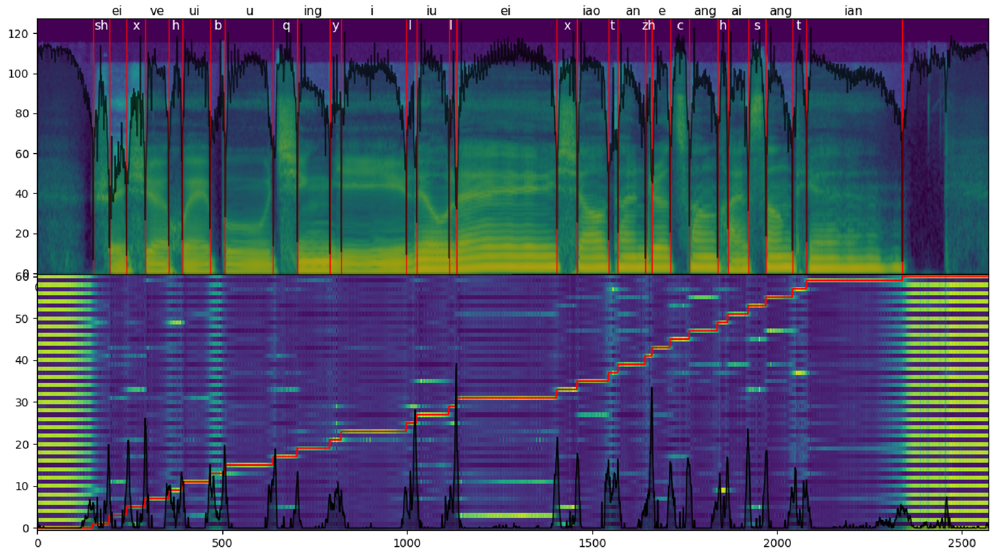

# SOFA: Singing-Oriented Forced Aligner

[English](README.MD) | 简体中文



# 介绍

SOFA(Singing-Oriented Forced Aligner)是一个专为歌声设计的强制对齐器，同时也兼容非歌声的对齐。

在歌声数据上，相比于MFA(Montreal Forced Aligner)，SOFA具有以下优点：

* 容易安装
* 效果更好
* 推理速度更快

# 使用方法

## 环境配置

1. 使用`git clone`​​下载本仓库的代码
2. 安装conda
3. 创建conda环境，python版本的要求为`3.8`
    ```bash
    conda create -n SOFA python=3.8 -y
    conda activate SOFA
    ```
4. 去[pytorch官网](https://pytorch.org/get-started/locally/)安装torch
5. （可选，用于提高wav读取速度）去[pytorch官网](https://pytorch.org/get-started/locally/)安装torchaudio
6. 安装其他python库
    ```bash
    pip install -r requirements.txt
    ```

## 推理

1. 下载模型文件。你可以在本仓库discussion的[模型分享板块](https://github.com/qiuqiao/SOFA/discussions/categories/pretrained-model-sharing)中找到训练好的模型，文件后缀为`.ckpt`。
2. 把字典文件放入`/dictionary`​​文件夹中。默认字典为`opencpop-extension.txt`​​
3. 准备需要强制对齐的数据，放入一个文件夹中（默认放在`/segments`​​文件夹），格式如下
    ```text
    - segments
        - singer1
            - segment1.lab
            - segment1.wav
            - segment2.lab
            - segment2.wav
            - ...
        - singer2
            - segment1.lab
            - segment1.wav
            - ...
    ```
    保证`.wav`文件和对应的`.lab`在同一个文件夹即可。

    其中，`.lab`文件是同名`.wav`文件的录音文本。录音文本的文件后缀名可以通过`--in_format`参数更改。
    
    录音文本经过`g2p`模块转化为音素序列后，输入模型进行对齐。

    例如，默认情况下使用`DictionaryG2P`模块和`opencpop-extension`词典时，加入录音文本的内容是：`gan shou ting zai wo fa duan de zhi jian`，`g2p`模块根据词典转化为音素序列`g an sh ou t ing z ai w o f a d uan d e zh ir j ian`。其他`g2p`模块的使用方法，参见[g2p模块使用说明](modules/g2p/readme_g2p_zh.md)。
    
4. 命令行推理

    使用`python infer.py`进行推理。

    需要指定的参数：
    - `--ckpt`：（必须指定）模型权重路径；
    - `--folder`：存放待对齐数据的文件夹​（默认为`segments`）；
    - `--in_format`： 录音文本的文件后缀名（默认为`lab`）；
    - `--out_formats`：推理出来的文件的标注格式，可指定多个，使用逗号分隔（默认为`TextGrid,htk,trans`）
    - `--save_confidence`：输出置信度。
    - `--dictionary`：字典文件​（默认为`dictionary/opencpop-extension.txt`​）；

    ```bash
    python infer.py -c checkpoint_path -s segments_path -d dictionary_path -of output_format1,output_format2...
    ```
5. 获取最终标注

    最终的标注保存在文件夹中，文件夹的名称是你选择的标注格式，这个文件夹的位置和推理所用的wav文件处于同一个文件夹中。

### 高级功能

   - 使用自定义的g2p，而不是使用词典
     - 参见[g2p模块使用说明](modules/g2p/readme_g2p_zh.md)
   - matching模式，推理时指定`-m`即可开启，会在给定的音素序列中找到一个使得概率最大的连续序列片段，而非必须用上所有音素。
## 训练

1. 参照上文进行环境配置。建议安装torchaudio以获得更快的binarize速度；
2. 把训练数据按以下格式放入`data`文件夹：

    ```
    - data
        - full_label
            - singer1
                - wavs
                    - audio1.wav
                    - audio2.wav
                    - ...
                - transcriptions.csv
            - singer2
                - wavs
                    - ...
                - transcriptions.csv
        - weak_label
            - singer3
                - wavs
                    - ...
                - transcriptions.csv
            - singer4
                - wavs
                    - ...
                - transcriptions.csv
        - no_label
            - audio1.wav
            - audio2.wav
            - ...
    ```
    关于`transcriptions.csv`的格式，参见：https://github.com/qiuqiao/SOFA/discussions/5
    
    其中：

    `transcriptions.csv`只需要和`wavs`文件夹的相对位置正确即可；

    `weak_label`中的`transcriptions.csv`无需拥有`ph_dur`这一个`column`；
3. 按需修改`binarize_config.yaml`，然后执行`python binarize.py`；
4. 在release中下载你需要的预训练模型，并按需修改`train_config.yaml`，然后执行`python train.py -p path_to_your_pretrained_model`；
5. 训练可视化：`tensorboard --logdir=ckpt/`。

## 评估（适用于模型开发者）

可通过在预测（强制对齐）标注与目标（人工）标注之间计算特定的客观评价指标（尤其是在k折交叉验证中）来评估模型性能。

一些有用的指标包括：

- 边界编辑距离：从预测的边界到目标边界的总移动距离。
- 边界编辑比率：边界编辑距离除以目标的总时长。
- 边界错误率：在给定的容差值下，位置错误的边界数占据目标边界总数的比例。

若要在特定的数据集上验证你的模型，请先运行推理以得到所有的预测标注。随后，你需要将预测标注与目标标注放置在不同的文件夹中，相对应的标注文件需要保持相同文件名、相同相对路径，并包含相同的音素序列（空白音素除外）。此脚本当前仅支持TextGrid格式。

运行以下命令：

```bash
python evaluate.py <PRED_DIR> <TARGET_DIR> -r -s
```

其中 `PRED_DIR` 是包含所有预测标注的目录，`TARGET_DIR` 是包含所有目标标注的目录。

可选项：
- `-r`, `--recursive`: 递归对比子文件夹中的文件
- `-s`, `--strict`: 使用严格模式（当音素序列不相同时报错而非跳过）
- `--ignore`: 忽略部分音素记号（默认值：`AP,SP,<AP>,<SP>,,pau,cl`）
